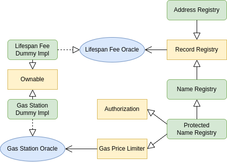

# Vanity name registering system resistant against frontrunning

## Task
Build a vanity name registering system resistant against frontrunning.
The purpose of the name is outside the scope of the assignment and you can make
reasonable assumptions on the size, encoding, etc of the name to complete in time.
An unregistered name can be registered for a certain amount of time by locking a certain
balance of an account. After the registration expires, the account loses ownership of the
name and his balance is unlocked. The registration can be renewed by making an on-chain
call to keep the name registered and balance locked.
You can assume reasonable defaults for the locking amount and period.
The fee to register the name depends directly on the size of the name. Also, a malicious
node/validator should not be able to front-run the process by censoring transactions of an
honest user and registering its name in its own account.

## Solution
The architecture of the project is multicomponent and can be represented in the form of such a diagram.
Where interfaces are represented as blue ellipses, yellow rectangles represent abstract or basic contracts, green rounded rectangles represent implementation.

The main base class is the **Record Registry**, where the low-level logic of the registration system is implemented. It has two descendants at the same level, each of which implements its own business logic: **Address Registry** and **Name Registry**. The **Name Registry**, has a successor, **Protected Name Registry**, which demonstrates 2 methods of countering the frontrunning attack: using **Authorization** and **Gas Throttling**. You can find a detailed description of each component below or in the code of the corresponding smart contract.

## Component Description
### Gas Station
**GasStation** contract interface, the implementation of which contains the current gas price and can be maintained by the responsible foundation or the interested community.

### Gas Station Dummy Impl
The simplest implementation of a **GasStation**, where the gas price is set by the administrator, who is also the owner of the contract.

### Lifespan Fee
The interface of **LifespanFee Oracle** is responsible for estimating and calculating the price of a record in the **RecordRegistry** based on the size of this record and the desired storage time.

### Lifespan Fee Dummy Impl
The simplest implementation of a **LifespanFee Oracle**, where the values are set by the the owner of the contract.

### Authorization
Simplest authorization system to prevent frontrunning. In fact, it does not completely solve the problem, but minimizes the chance of an attack by hiding sensitive information with a hashing function. It will not be profitable for an attacker to frontrun authorization, because he does not know in advance what real data is hidden behind authorization calls. In addition, a spam counterattack can be implemented by authorizing a huge number of random messages, obfuscating and overwhelming the attacker. Additional conditions can also be implemented in the form of locking the balance and setting the authorization validity period.

### Gas Price Limiter
This limits attackers from seeking preferential treatment from miners due to the higher gas price. The problem here is that such a solution must be constantly maintained as the gas price is very volatile. Therefore, it makes sense to use this solution together with an **GasStation Oracle**, the relevance of the values of which will be supported by the interested community.

### Record Registry
The basic contract of a records registry, where the key is a 32-byte digest and the value is an object with the characteristics of this record and string data. To register a record, you need pass the record label, balance to lock, and data as a string. The lifespan is calculated according to the rules specified in the **LifespanFee Oracle** and directly depends on the size of the data and the locked balance. After the expiration of the record lifespan, it can be renewed and the balance will be left locked.

### Address Registry
Implementation of the address registry, where the data is an Ethereum address without "0x" consisting of 40 characters and corresponding to the HEX alphabet. The record key is a hash of any string selected as a key.

### Name Registry
The simplest application implementation of the name registry, where data is any string value and the record key - the hash of this data.

### Protected Name Registry
The inheritor of the **Name Registry**, contains frontrunning-resistant functions for registering new names. Read more about frontrunning protection methods in the corresponding paragraphs.
